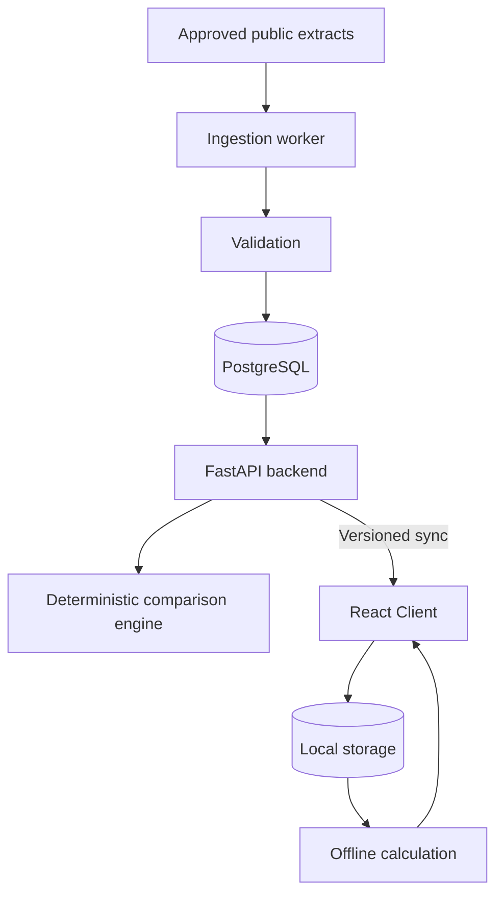

# Architecture Diagram

```mermaid
flowchart TD
    S[Approved public extracts] --> I[Ingestion worker]
    I --> Q[Validation]
    Q --> DB[(PostgreSQL)]
    DB --> A[FastAPI backend]
    A --> R[Deterministic comparison engine]
    A --> |Versioned sync| M[React Client]
    M --> L[(Local storage)]
    L --> O[Offline calculation]
    O --> M
```
